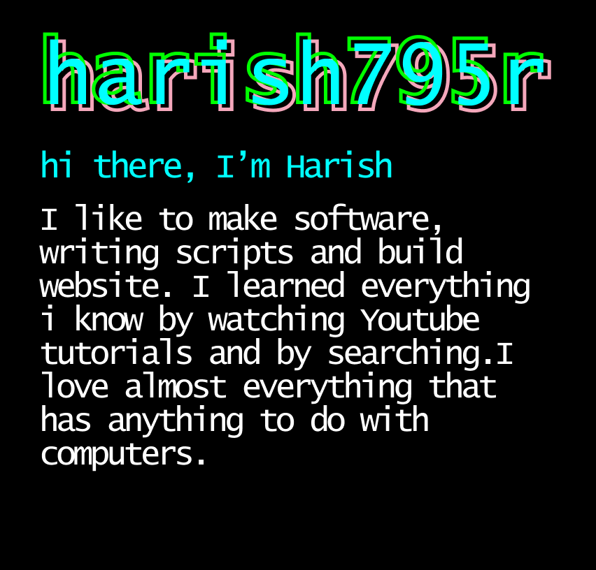

### Connect With Me:

[][Stack Overflow Profile]
[][Git Hub Profile]
[][harish795's DEV Profile]

Discord - harish795r#0072
 

 

[Stack Overflow Profile]: https://stackoverflow.com/users/14588234/harish795
[Git Hub Profile]: https://github.com/harish795r
[harish795's DEV Profile]: https://dev.to/harish795
[Visual Studio Code]: https://code.visualstudio.com/ 

 

  
